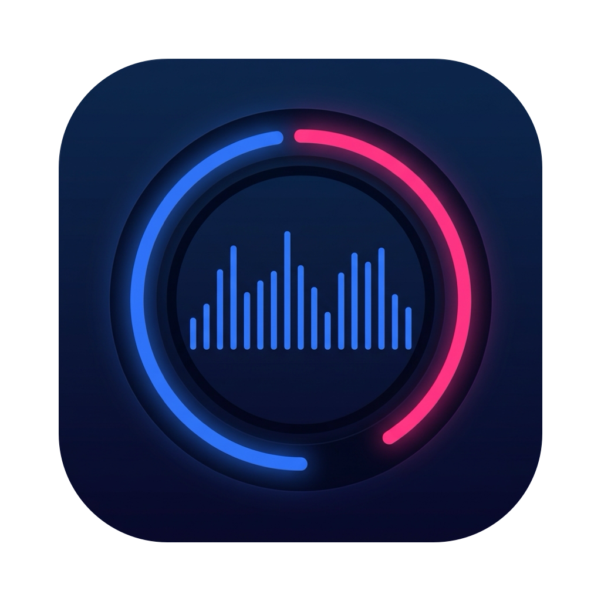
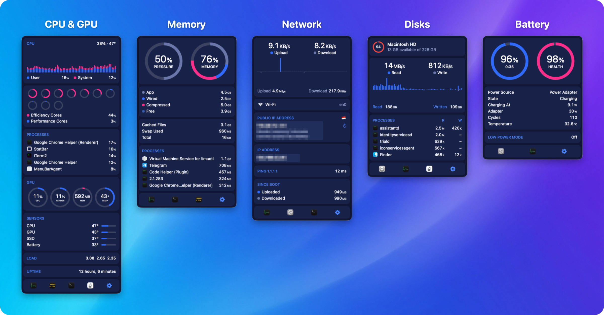

<p align="center">
  
</p>

<h1 align="center">StatBar</h1>

<p align="center">
  A native macOS menu bar system monitor in the spirit of iStat Menus — CPU, GPU, memory, network,
  disks, battery and temperatures at a glance, with a detailed dropdown one click away.<br>
  Plain Swift and SwiftUI. No helper tool, no root, no account.
</p>

<p align="center">
  <a href="#install">
    
  </a>
  <a href="https://github.com/ahmadarif-lab/statbar/releases/latest">
    
  </a>
</p>

<p align="center">
  
</p>

## Install

> [!TIP]
> **Homebrew is the easiest way — one command, nothing else to set up:**
>
> ```sh
> brew install --cask ahmadarif-lab/tap/statbar
> ```
>
> It adds the `ahmadarif-lab/tap` tap, clears the quarantine flag so the app opens straight away —
> no Gatekeeper warning to click through — and launches it once installed.

StatBar starts itself at login from the first launch onwards (via `SMAppService`). Turn that off
under **Settings → General → Start at login**, or in System Settings → General → Login Items.

### Manual install (DMG)

1. Download `StatBar.dmg` from [Releases](https://github.com/ahmadarif-lab/statbar/releases/latest).
2. Open it and drag **StatBar** onto the **Applications** shortcut next to it.
3. StatBar is ad-hoc signed rather than signed with a Developer ID and notarized, so macOS blocks
   the first launch. Clear the quarantine flag once:

   ```sh
   xattr -dr com.apple.quarantine /Applications/StatBar.app
   ```

   Or open it once, then go to **System Settings → Privacy & Security** and click **Open Anyway**.

### Updating

With **Automatically check for updates** on, StatBar looks for a new release at launch and every six
hours; **Check for Updates** in Settings → General does it on demand. A Homebrew install is upgraded
in place and relaunches on its own; a DMG install opens the release page instead.

Or from the terminal:

```sh
brew upgrade --cask statbar
```

### Uninstall

```sh
brew uninstall --cask statbar      # or drag /Applications/StatBar.app to the Trash
```

## Features

Each item sits in the menu bar on its own and opens its own dropdown right below it. CPU and GPU
share one item, since they share a dropdown.

| Item | Dropdown |
| --- | --- |
| **CPU & GPU** | user + system history, a ring per core coloured by efficiency / performance cluster, top processes, GPU / render / memory / temperature gauges, sensors (CPU, GPU, SSD and battery temperatures, fans on Macs that have them), load average, uptime |
| **Memory** | pressure and memory rings, app / wired / compressed / free, cached files, swap, top processes |
| **Network** | upload / download history with peaks, interface, public IP with country flag and location, local IP, ping, totals since boot |
| **Disks** | every volume with its free space, read / write history, top processes by disk I/O |
| **Battery** | charge with time remaining, health, power draw, adapter wattage, cycle count, temperature, Low Power Mode |

Every dropdown ends with shortcuts to the relevant apps and a gear for **Settings** — an ordinary
window, so it stays put while you change things. Opening StatBar from Finder or Launchpad brings it
up too; right-clicking any menu bar item offers Settings and Quit.

**General**

- Themes for the dropdowns: System, Dark, Light, Midnight, Graphite, Ocean, Forest and Sunset,
  previewed live on the real dropdown
- Show or hide each item and drag them into the order you want; trim their padding, or tighten the
  spacing between every app's menu bar icons (a macOS-wide setting)
- Start at login, a Dock icon while Settings is open, automatic update checks
- Export, import and reset of the settings

**Per item**

- Update interval — 1, 2, 5 or 10 seconds, 1 second by default
- How many top processes to list (CPU, Memory, Disks)
- CPU: a history graph and the temperature next to the figure in the menu bar
- Network: which interface to measure, bytes or bits, public IP and how often to refresh it, ping
  host

## Privacy

Everything is read locally except the **public IP address**, which is looked up from
[ipinfo.io](https://ipinfo.io) (along with its country and city) when that option is on — it is by
default. Switch it off under **Settings → Network**. The update check asks GitHub's release API for
the latest version, and only while **Automatically check for updates** is on or when you click
**Check for Updates**.

## Requirements

- macOS 14 (Sonoma) or later, Apple silicon or Intel
- Xcode command line tools with Swift 5.10+, only to build from source

## Build from source

```sh
./Scripts/run_dev.sh          # swift run, for quick iteration
./Scripts/build_app.sh        # universal, ad-hoc signed dist/StatBar.app
./Scripts/package_release.sh  # the app in dist/StatBar.dmg, plus its sha256 for the cask
open dist/StatBar.app
swift test                    # StatKit unit tests and live-sampler smoke tests
STATBAR_LIVE_TESTS=1 swift test --filter LiveNetworkTests   # also hits the network
```

## How it reads the numbers

All sampling lives in the `StatKit` library:

- **CPU** — `host_processor_info` tick counters, diffed between samples; core types from the
  device tree's `cluster-type`
- **Memory** — `host_statistics64` (the same "Memory Used" formula as Activity Monitor),
  `vm.swapusage`, `kern.memorystatus_level`
- **Network** — `NET_RT_IFLIST2` 64-bit interface counters; ping is a TCP handshake to port 443,
  since ICMP needs root
- **Disks** — `IOBlockStorageDriver` statistics, volume capacity from `URLResourceValues`
- **GPU** — `IOAccelerator` `PerformanceStatistics`
- **Battery** — IOPowerSources plus the `AppleSmartBattery` registry entry
- **Processes** — `proc_listallpids` + `proc_pid_rusage`, only while a dropdown that lists them is
  open
- **Temperatures and fans** — read-only SMC keys, with the per-chip key lists from
  [Stats](https://github.com/exelban/stats), and the SSD's temperature from the HID sensor hub.
  These are undocumented interfaces, looked up at run time, so a future macOS could change them;
  the rest of the app keeps working if it does.

Processes owned by root can't be read without a privileged helper, which StatBar deliberately
doesn't install, so they're missing from the top lists.

## Support

StatBar is free and open source. If it helps you, a prayer for its developer is all the support
asked. 🤲

## License

[MIT](LICENSE)
